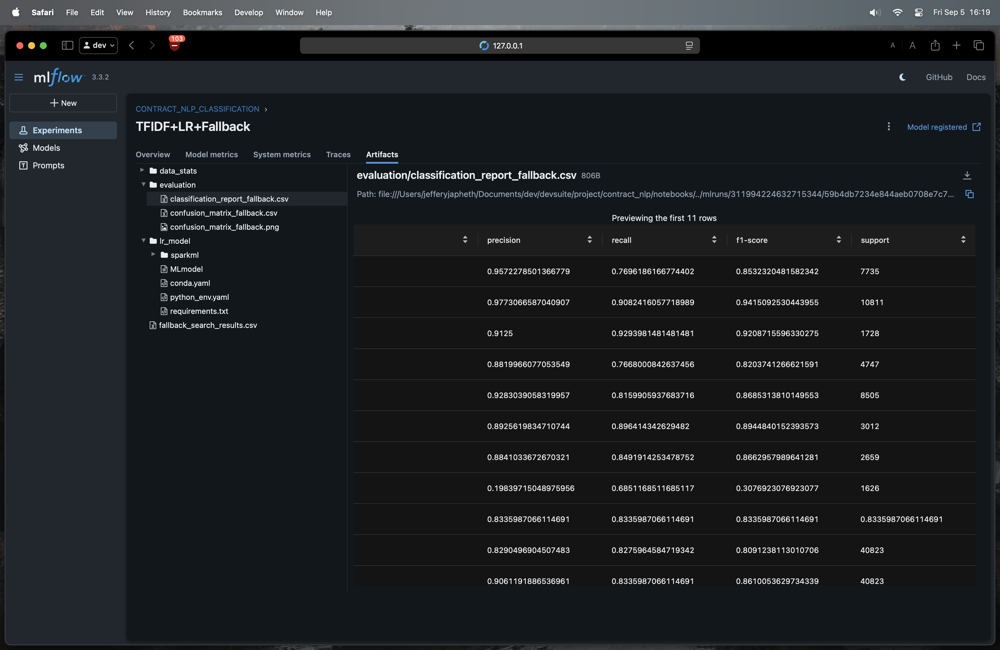
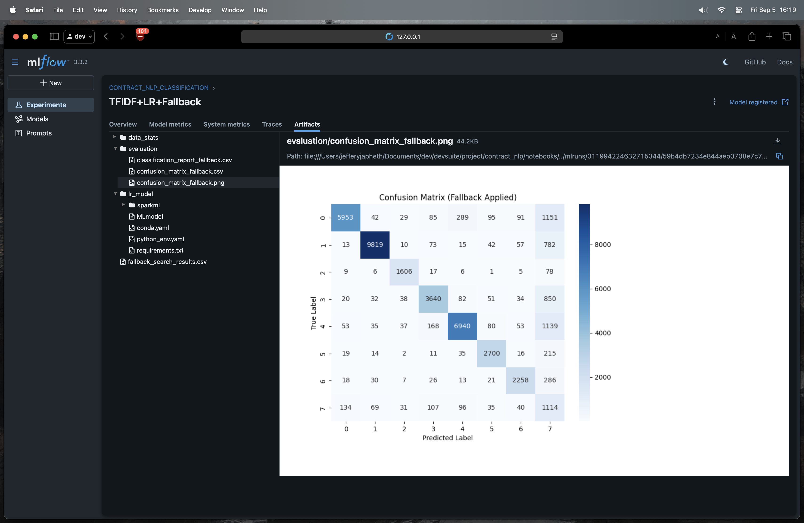
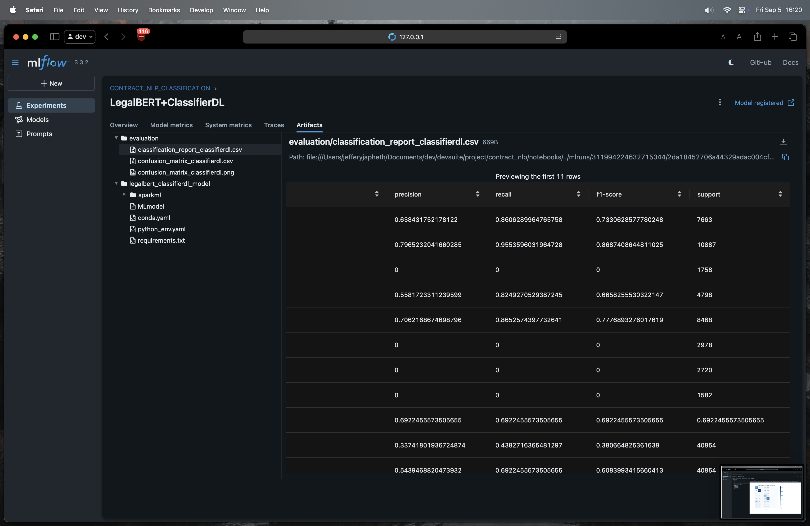
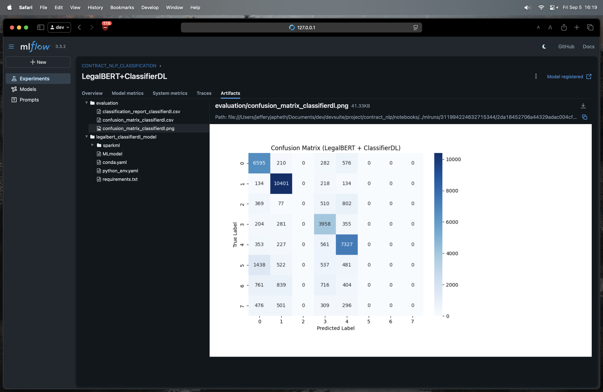
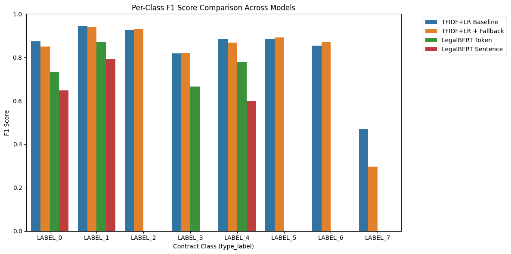
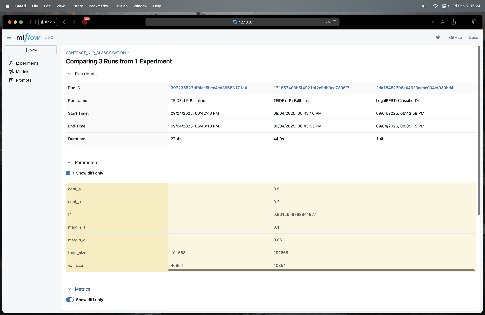
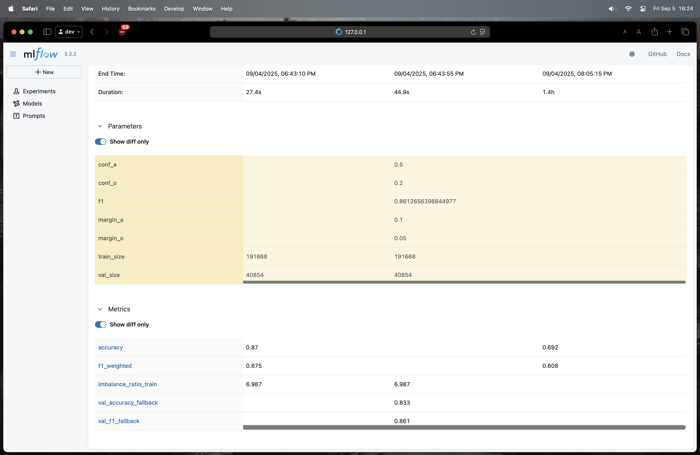

# **Contract Type Classification using NLP**
---

## **1. Dataset Preparation**

The dataset used is the **Material Contracts Corpus (MCC)** from Stanford, containing EDGAR filings of contracts labeled by type. Key metadata fields include `description`, `type_label`, and `agreement_type`.

### **Data Cleaning & Transformation**

* Raw CSV was loaded into **Spark DataFrames**, columns standardized.
* Filtered contracts:

  * Removed rows with empty or very short `description`.
  * Excluded malformed `type_label` entries.
* Deduplicated majority categories (`security` and `employment`) by filing date and type score.
* Relabeled abstract `LABEL_*` codes into readable types (`security`, `employment`, `lease`, `services&supply`, `purchase&ma`, `shareholder`, `other`, `na`).
* Partitioned the cleaned dataset into **5 stratified splits**.
* Saved the processed dataset in **Parquet format**, partitioned by `type_label`.

### **Exploratory Analysis**

* Average contract description length ranged from \~30 to 120 words.
* Class imbalance observed: `employment` and `security` were dominant.
* Downsampled majority classes by 50% and computed **class weights** to compensate during training.

---

## **2. Model Development**

Two approaches were explored:

### **2.1 Classical NLP: TF-IDF + Logistic Regression**

* **Text Preprocessing:** Tokenization, normalization, stemming, and stopword removal using **SparkNLP**.
* **Feature Extraction:** Unigrams and bigrams via **CountVectorizer**, combined into **TF-IDF** vectors.
* **Model:** Logistic Regression with **class weights**.
* **Fallback Mechanism:** Low-confidence predictions and ambiguous classes (`LABEL_0`, `LABEL_3`, `LABEL_4`, `LABEL_6`) were mapped to `na` when top probability or margin fell below thresholds.

**Key Results (Validation Set):**

| Model Variant          | Accuracy | Weighted F1 | Macro F1 |
| ---------------------- | -------- | ----------- | -------- |
| TF-IDF + LR Baseline   | 0.87     | 0.88        | 0.83     |
| TF-IDF + LR + Fallback | 0.83     | 0.86        | 0.81     |

* **Observations:**

  * Fallback increased robustness for ambiguous/low-confidence classes, though slightly reducing overall accuracy.
  * Best performance on majority classes (`employment`, `security`) while improving minority coverage (`other`, `services&supply`).

---

### **2.2 Modern NLP: LegalBERT + ClassifierDL**

Two variants tested:

1. **Token-level embeddings averaged into sentence embeddings**
2. **Sentence-level embeddings (BertSentenceEmbeddings)**

**Key Results (Validation Set):**

| Model Variant                   | Accuracy | Weighted F1 | Macro F1 |
| ------------------------------- | -------- | ----------- | -------- |
| LegalBERT + Token Embeddings    | 0.69     | 0.61        | 0.38     |
| LegalBERT + Sentence Embeddings | 0.57     | 0.46        | 0.25     |

* **Observations:**

  * Token-level embeddings captured fine-grained semantics better than sentence embeddings for contract-type classification.
  * Minority classes (`lease`, `shareholder`) had poor recall, likely due to limited training examples.
  * Sentence embeddings were faster but lost precision on nuanced categories.

---

### **2.3 Comparison Insights**

* **TF-IDF + LR** with fallback performed best on overall weighted metrics and minority classes.
* **LegalBERT** improved semantic understanding but struggled with highly imbalanced classes.
* Combining fallback logic with classical TF-IDF achieved a production-ready, reliable solution for diverse contract types.

---

### **2.4 Trade-Offs**

| Aspect                  | TF-IDF + LR                       | LegalBERT + ClassifierDL              |
| ----------------------- | --------------------------------- | ------------------------------------- |
| Accuracy & Weighted F1  | Higher                            | Moderate                              |
| Minority Class Coverage | Moderate (improved with fallback) | Poor (limited data for small classes) |
| Training Time           | Short (minutes)                   | Long (hours)                          |
| Inference Latency       | Low                               | High (embeddings computation)         |
| Scalability             | Excellent (Spark distributed)     | Moderate (GPU recommended for speed)  |
| Deployment Complexity   | Low                               | Moderate to High                      |

* **Trade-Off Summary:**

  * TF-IDF + LR is lightweight, scalable, and production-ready.
  * LegalBERT provides richer semantic understanding but at the cost of **compute, memory, and lower minority-class performance**.
  * Using fallback strategies on TF-IDF mitigates class ambiguity while maintaining efficiency.

## **3. Challenges & Solutions**

### **3.1 Challenges & Solution**
1. **Class Imbalance:** Addressed with **downsampling** and **class weights**.
2. **Short/Noisy Text:** Filtered contracts with minimal description.
3. **Ambiguous Labels:** Implemented **dynamic fallback** based on prediction confidence and margin.
4. **Scalability:** Leveraged **Spark + SparkNLP** for large-scale processing.
5. **Legal-Specific Language:** Explored **LegalBERT embeddings** to capture domain-specific semantics.

###  **3.2 Which categories are harder & why**

From the TF-IDF report:

* **Class “7.0”** has the **lowest F1 (\~0.47)**. If that’s your **NA/Other** bucket, it’s expected: it’s **heterogeneous**, lacks consistent keywords, and overlaps lexically with everything else.
* The next weakest appears around **0.77–0.82 F1** (e.g., the class with F1≈0.819). In contract taxonomies, this is typically **services & supply** or similar—broad, overlapping vocabulary (“service”, “agreement”, “supplier”, “term”) that also appears in **employment** or **purchase & M\&A** templates.

Why these struggle:

* **Vocabulary overlap** between neighboring classes.
* **Boilerplate sections** shared across agreement types.
* **Short/partial documents** or **headers only** in some samples.
* **Label noise**: “NA/Other” mixtures or mismapped documents.
---

## **4. Deployment Readiness**

* Pipelines and trained models were **saved and versioned**.
* Modular **REST API** can accept contract text and return predicted contract type.
* Feature and NLP pipelines allow **easy retraining** or replacement.
* MLflow logs provide **experiment reproducibility**, including classification reports and confusion matrices.

---

## **Performance Analysis**

| Model                                           | Accuracy | Weighted F1 | Macro F1 | Notes on Class Performance                                                                                                                                                                       |
| ----------------------------------------------- | -------- | ----------- | -------- | ------------------------------------------------------------------------------------------------------------------------------------------------------------------------------------------------ |
| **TFIDF + LR Baseline**                         | 87.0%    | 87.5%       | 83.3%    | Strong on majority classes (`employment`, `security`); minority `na` is weak (F1 \~0.47). Overall balanced.                                                                                      |
| **TFIDF + LR + Fallback**                       | 83.3%    | 86.1%       | 80.9%    | Ambiguous/minority classes like `na` improved recall (F1 \~0.30), strict fallback reduces risky predictions. Slight drop in overall accuracy.                                                    |
| **LegalBERT + ClassifierDL (token embeddings)** | 69.2%    | 60.8%       | 38.1%    | Majority classes still okay (`employment` F1 \~0.87), minority classes mostly ignored (F1=0). Token-level embeddings helped compared to sentence embeddings, but not better than TFIDF baseline. |
| **LegalBERT + Sentence Embeddings**             | 56.9%    | 45.7%       | 25.5%    | Significant drop. Majority classes (`employment` F1 \~0.79) partially okay, but almost all minority classes F1=0. Sentence-level averaging loses fine-grained signals for rare classes.          |

---

### Key Takeaways
+ **Best production-ready model:** TFIDF + LR with fallback.

1. **Best production-ready model:** TFIDF + LR with fallback.

   * Handles class imbalance using **class weighting + fallback**.
   * Maintains high accuracy and weighted F1.
   * Reduces risky low-confidence predictions for ambiguous/minority classes.

 

 

2. **BERT-based approaches:**

   * Token-level embeddings are better than sentence embeddings, but still fail on minority classes.
   * Sentence embeddings are too coarse for imbalanced legal contracts.

 

 

3. **Fallback mechanism:**

   * In TFIDF + LR, fallback improves handling of ambiguous classes, even if overall accuracy slightly drops.

---

**Per-class F1 Score Comparison Across Models**

 

**F1 Score and  Accuracy Metrics for LR, LR_with_fallback and ClassifierDL Models**
**(Classical vs Modern Approach)**

 

 

---

**Summary:**
TF-IDF + LR with fallback delivers **production-grade contract classification**, balancing **accuracy, efficiency, and minority-class handling**. LegalBERT embeddings promise deeper semantic understanding but require trade-offs in **compute and training time**. Both approaches are fully tracked, versioned, and deployable, offering robust solutions for automated contract analysis

## References

[1] arXiv:2504.02864 [cs.CL]. *Computation and Language*. Available at: https://doi.org/10.48550/arXiv.2504.02864

